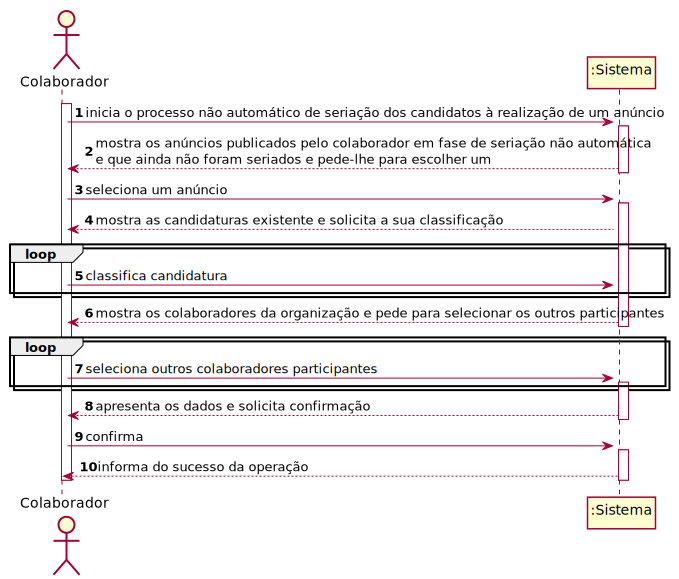
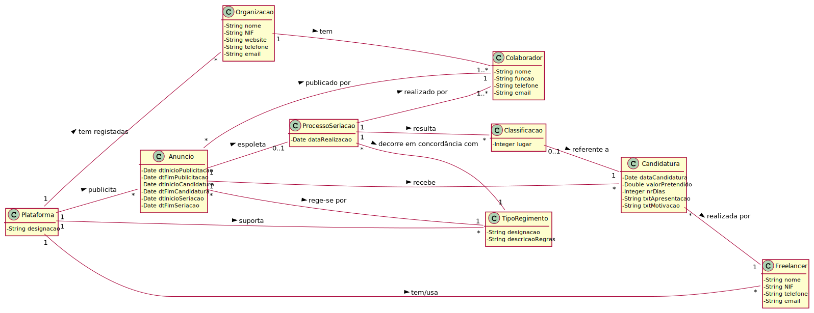
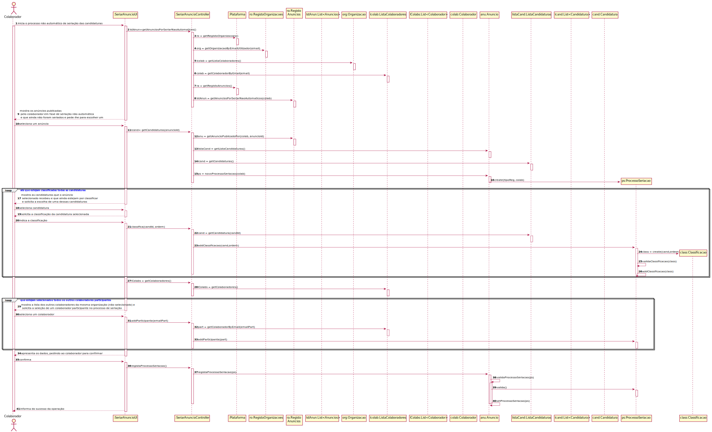
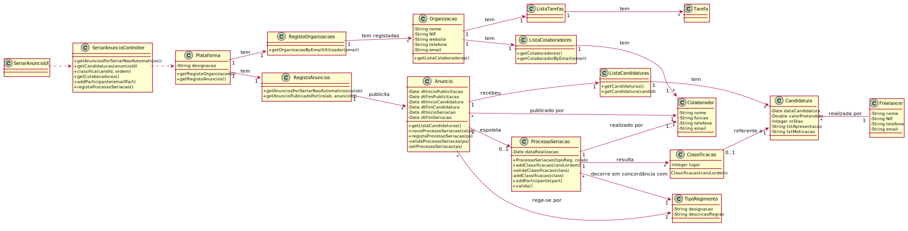

# UC 10 - Seriar (Não Automaticamente) Candidaturas de Anúncio

## 1. Engenharia de Requisitos

### Formato Breve

O colaborador de organização inicia o processo não automático de seriação dos candidatos à realização de um anúncio. O sistema mostra os anúncios publicados pelo colaborador em fase de seriação não automática e que ainda não foram seriadas e pede-lhe para escolher um. O colaborador seleciona um anúncio. O sistema mostra as candidaturas existente e solicita a sua classificação. O colaborador classifica as candidaturas. O sistema mostra os colaboradores da organização e pede para selecionar os outros participantes no processo. O colaborador seleciona. O sistema valida e apresenta os dados, pedindo que os confirme. O colaborador confirma. O sistema regista os dados juntamente com a data/hora atual e informa o colaborador do sucesso da operação. 

### SSD

### Formato Completo

#### Ator principal

Colaborador

#### Partes interessadas e seus interesses
* **Colaborador:** pretende classificar as candidaturas que um anúncio da sua organização recebeu.
* **Organização:** pretende contratar freelancers com determinadas competências técnicas para executar tarefas publicadas.
* **Freelancer:** pretende conhecer os resultados da seriação de candidaturas e se a sua teve sucesso.
* **T4J:** pretende satisfazer organizações e freelancers, providenciando um "matching" entre ambos.

#### Pré-condições
* Organização e Gestor de Organização estão registados no sistema.
* Colaborador da Organização já foi registado.
* O sistema conta com áreas de atividade, categorias de tarefa e competências técnicas já definidas.
* Existem tipos de regimento definidos no sistema.
* Existem anúncios publicados.
* Existem freelancers registados e com competências técnicas adequadas.
* Existem candidaturas de freelancers a anúncios.
* Existe, pelo menos, um anúncio pronto a ser seriado (i.e. prazos de candidatura terminados).

#### Pós-condições
* A informação da seriação é registada no sistema.

### Cenário de sucesso principal (ou fluxo básico)

1. O colaborador inicia o processo não automático de seriação das candidaturas a um anúncio.
2. O sistema mostra os anúncios publicadas pelo colaborador em fase de seriação não automática e que ainda não foram seriados e pede-lhe para escolher um.
3. O colaborador seleciona um anúncio.
4. O sistema mostra as candidaturas que o anúncio selecionado recebeu e que ainda estejam por classificar e solicita a escolha de uma dessas candidaturas.
5. O colaborador seleciona uma candidatura.
6. O sistema solicita a classificação da candidatura selecionada.
7. O colaborador indica a classificação.
8. Os passos 4 a 7 repetem-se até que estejam classificadas todas as candidaturas.
9. O sistema mostra a lista dos outros colaboradores da mesma organização (não selecionado) e solicita a seleção de um colaborador participante no processo de seriação.
10. O colaborador seleciona um colaborador.
11. Os passos 9 e 10 repetem-se até que estejam selecionados todos os outros colaboradores participantes no processo de seriação.
12. O sistema valida e apresenta os dados, pedindo ao colaborador para confirmar.
13. O colaborador confirma.
14. O sistema regista os dados juntamente com a data/hora atual e informa o colaborador do sucesso da operação.

#### Extensões (ou fluxos alternativos)

*a. O colaborador solicita o cancelamento do processo de seriação das candidaturas.
> O caso de uso termina.

12a. Dados mínimos obrigatórios em falta.
>	1. O sistema informa quais os dados em falta.
>	2. O sistema permite a introdução dos dados em falta (passo 2)
>
	> 2a. O colaborador não altera os dados. O caso de uso termina.

#### Requisitos especiais

#### Lista de Variações de Tecnologias e Dados
\-

#### Frequência de Ocorrência
\-

#### Questões em aberto

* Se não houver qualquer candidatura, o anúncio reabre outra vez? Se sim, por quanto tempo? De forma automática?
* Se houver duas ou mais candidaturas empatadas, como se processa o critério de desempate?
* É possível a desclassificação de candidaturas? Se sim, porquê?
* Deve um freelancer ser notificado caso haja alguma irregularidade na candidatura? Se sim, resulta na sua desclassificação, ou basta fazer a alteração devida?

## 2. Análise OO

### Excerto do Modelo de Domínio Relevante para o UC

## 3. Design - Realização do Caso de Uso

###	Diagrama de Sequência

###	Diagrama de Classes

