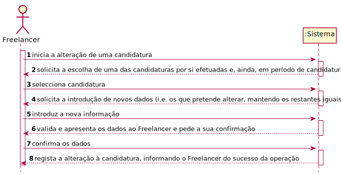
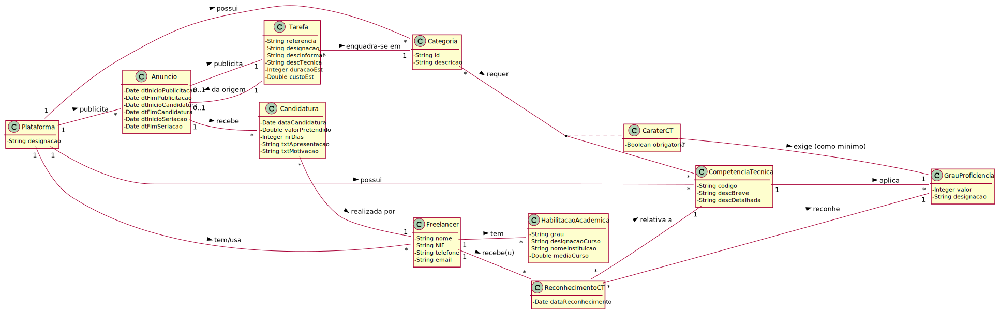
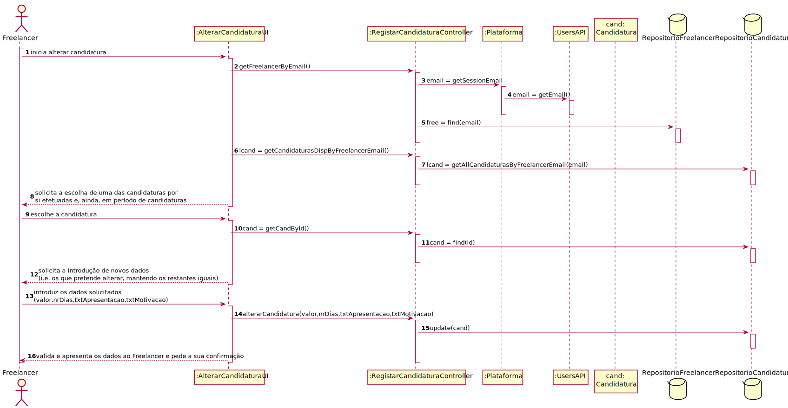
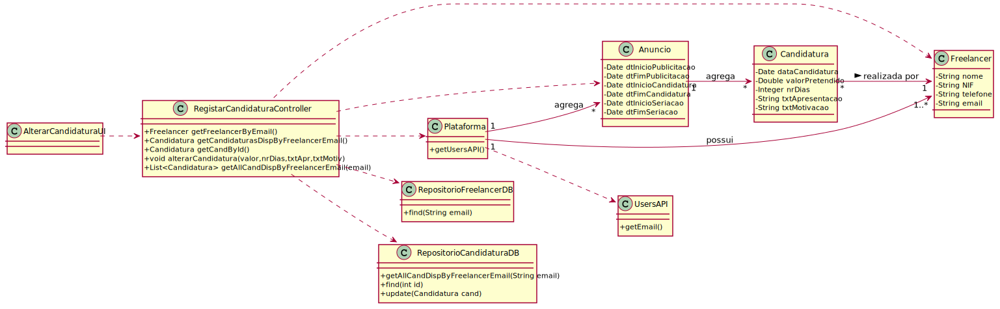

# UC11 - Alterar Candidatura

## 1. Engenharia de Requisitos

### Formato Breve

O Freelancer inicia a alteração de uma candidatura. O sistema solicita a escolha de uma das candidaturas por si efetuadas e, ainda, em período de candidaturas. O Freelancer escolhe. O sistema solicita a introdução de novos dados (i.e. os que pretende alterar, mantendo os restantes iguais). O Freelancer introduz a nova informação. O sistema solicita a confirmação. O Freelancer confirma. O sistema regista a alteração à candidatura, informando o Freelancer do sucesso da operação. 

### SSD

### Formato Completo

#### Ator principal

Freelancer

#### Partes interessadas e seus interesses
* **Organização:** pretende que as candidaturas associadas aos seus anúncios tenham informação atualizada.
* **Freelancer:** pretende verificar a lista de candidaturas por si efetuadas e alterar algumas.
* **T4J:** deseja rececionar candidaturas para posterior seriação e atribuição de tarefas afetas a organizações.

#### Pré-condições
* Organização e Gestor de Organização estão registados no sistema.
* Colaborador da Organização já foi registado.
* O sistema conta com áreas de atividade, categorias de tarefa e competências técnicas já definidas.
* Pelo menos um freelancer já foi registado.
* Tarefas já foram publicadas, tendo originado anúncios.
* Período de candidaturas de, pelo menos, um anúncio já começou e ainda não terminou.
* Pelo menos uma candidatura já foi efetuada e é passível de ser alterada.

#### Pós-condições
* As alterações à candidatura são registadas no sistema.

### Cenário de sucesso principal (ou fluxo básico)

1. O Freelancer inicia a alteração de uma candidatura.
2. O sistema solicita a escolha de uma das candidaturas por si efetuadas e, ainda, em período de candidaturas.
3. O Freelancer escolhe.
4. O sistema solicita a introdução de novos dados (i.e. os que pretende alterar, mantendo os restantes iguais).
5. O Freelancer introduz a nova informação. 
6. O sistema valida e apresenta os dados ao Freelancer e pede a sua confirmação.
7. O Freelancer confirma os dados.
8. O sistema regista a alteração à candidatura, informando o Freelancer do sucesso da operação. 

#### Extensões (ou fluxos alternativos)

*a. O Freelancer solicita o cancelamento da alteração de uma candidatura.
> O caso de uso termina.

2a. Não existem candidaturas em período aberto.
> O caso de uso termina.

6a. Dados mínimos obrigatórios em falta.
>	1. O sistema informa quais os dados em falta.
>	2. O sistema permite a introdução dos dados em falta (passo 4)
>
	> 2a. O freelancer não altera os dados. O caso de uso termina.

6b. O sistema deteta que os dados introduzidos (ou algum subconjunto dos dados) são inválidos.
>   1. O sistema alerta o Freelancer para o facto.
>   2. O sistema permite a sua alteração (passo 5).
>
	> 2a. O Freelancer não altera os dados. O caso de uso termina.

#### Requisitos especiais

#### Lista de Variações de Tecnologias e Dados
\-

#### Frequência de Ocorrência
\-

#### Questões em aberto

* O freelancer pode alterar mais do que uma vez a mesma candidatura?
* O freelancer pode alterar quais dados em concreto?
* O freelancer pode adicionar competências técnicas e habilitações académicas, sendo essas alterações validadas para as candidaturas por si já efetuadas (e ainda dentro do período de candidaturas)?

## 2. Análise OO

### Excerto do Modelo de Domínio Relevante para o UC

## 3. Design - Realização do Caso de Uso

###	Diagrama de Sequência

###	Diagrama de Classes

