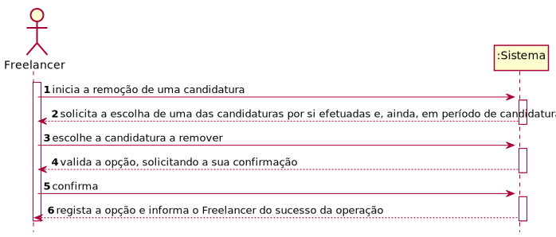
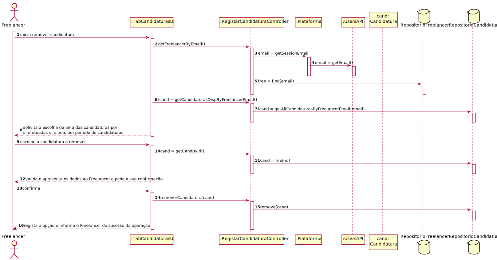
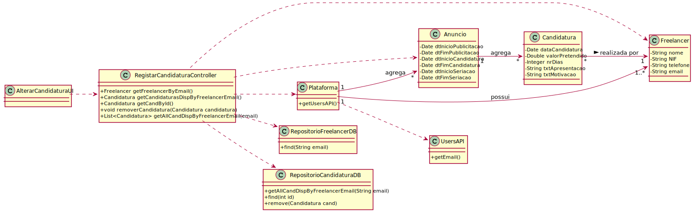

# UC12 - Remover Candidatura

## 1. Engenharia de Requisitos

### Formato Breve

O Freelancer inicia a remoção de uma candidatura. O sistema solicita a escolha de uma das candidaturas por si efetuadas e, ainda, em período de candidaturas. O Freelancer escolhe a candidatura a remover. O sistema valida a opção, solicitando a sua confirmação. O Freelancer confirma. O sistema regista a opção e informa o Freelancer do sucesso da operação.

### SSD

### Formato Completo

#### Ator principal

Freelancer

#### Partes interessadas e seus interesses
* **Organização:** pretende saber as candidaturas feitas a anúncios seus para posterior seriação.
* **Freelancer:** pretende verificar a lista de candidaturas por si efetuadas e remover alguma.
* **T4J:** deseja rececionar candidaturas para posterior seriação e atribuição de tarefas afetas a organizações.

#### Pré-condições
* Organização e Gestor de Organização estão registados no sistema.
* Colaborador da Organização já foi registado.
* O sistema conta com áreas de atividade, categorias de tarefa e competências técnicas já definidas.
* Pelo menos um freelancer já foi registado.
* Tarefas já foram publicadas, tendo originado anúncios.
* Período de candidaturas de, pelo menos, um anúncio já começou e ainda não terminou.
* Pelo menos uma candidatura já foi efetuada e é passível de ser removida.

#### Pós-condições
* A remoção da candidatuara é registada no sistema.

### Cenário de sucesso principal (ou fluxo básico)

1. O Freelancer inicia a remoção de uma candidatura.
2. O sistema solicita a escolha de uma das candidaturas por si efetuadas e, ainda, em período de candidaturas.
3. O Freelancer escolhe a candidatura a remover.
4. O sistema valida a opção, solicitando a sua confirmação.
5. O Freelancer confirma. 
6. O sistema regista a opção e informa o Freelancer do sucesso da operação.

#### Extensões (ou fluxos alternativos)

*a. O Freelancer solicita o cancelamento da remoção de uma candidatura.
> O caso de uso termina.

2a. Não existem candidaturas em período aberto.
> O caso de uso termina.

#### Requisitos especiais

#### Lista de Variações de Tecnologias e Dados
\-

#### Frequência de Ocorrência
\-

#### Questões em aberto

## 2. Análise OO

### Excerto do Modelo de Domínio Relevante para o UC

## 3. Design - Realização do Caso de Uso

###	Diagrama de Sequência

###	Diagrama de Classes

