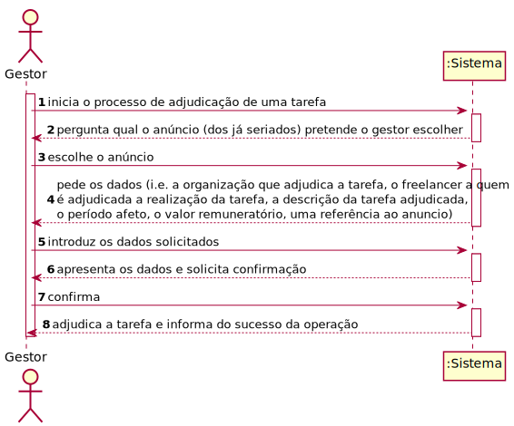
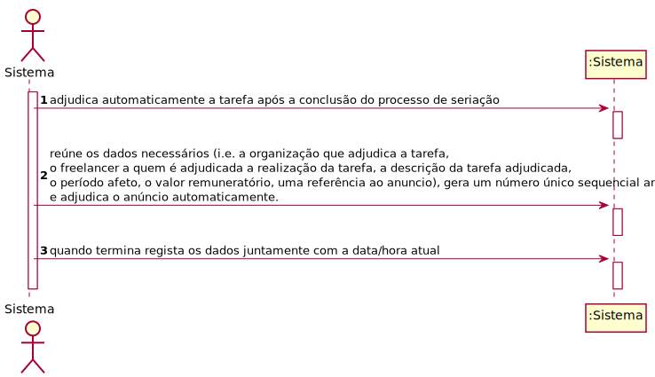
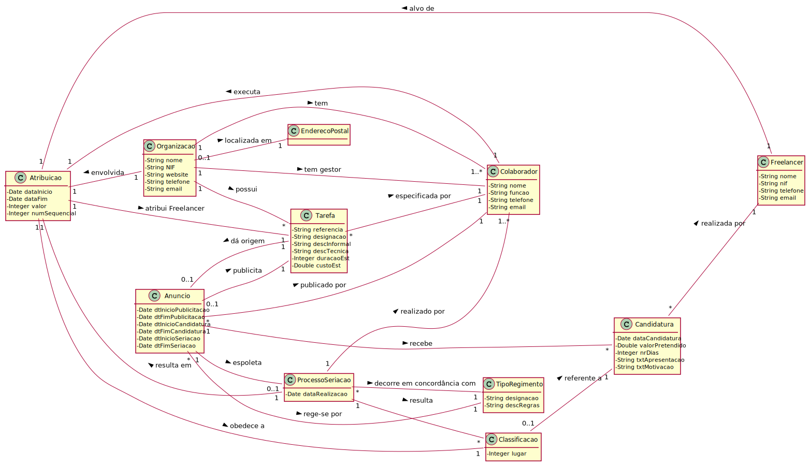
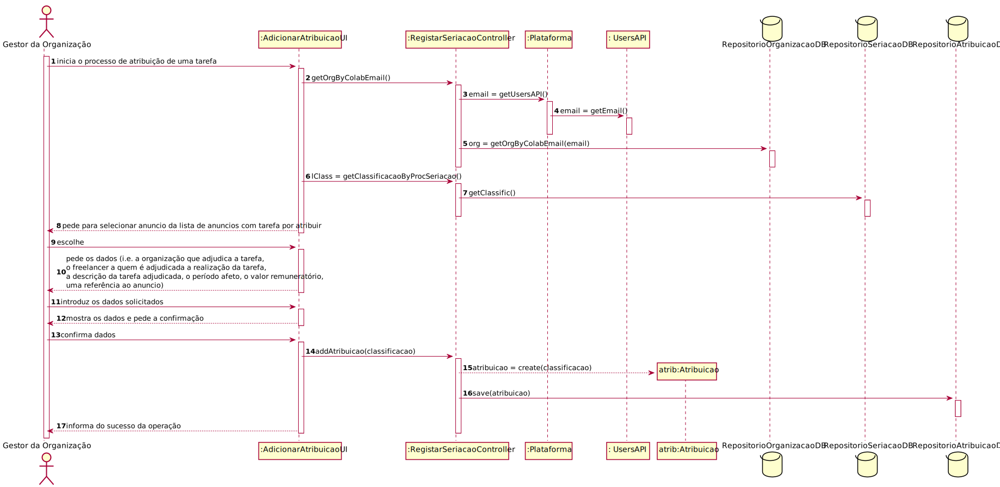
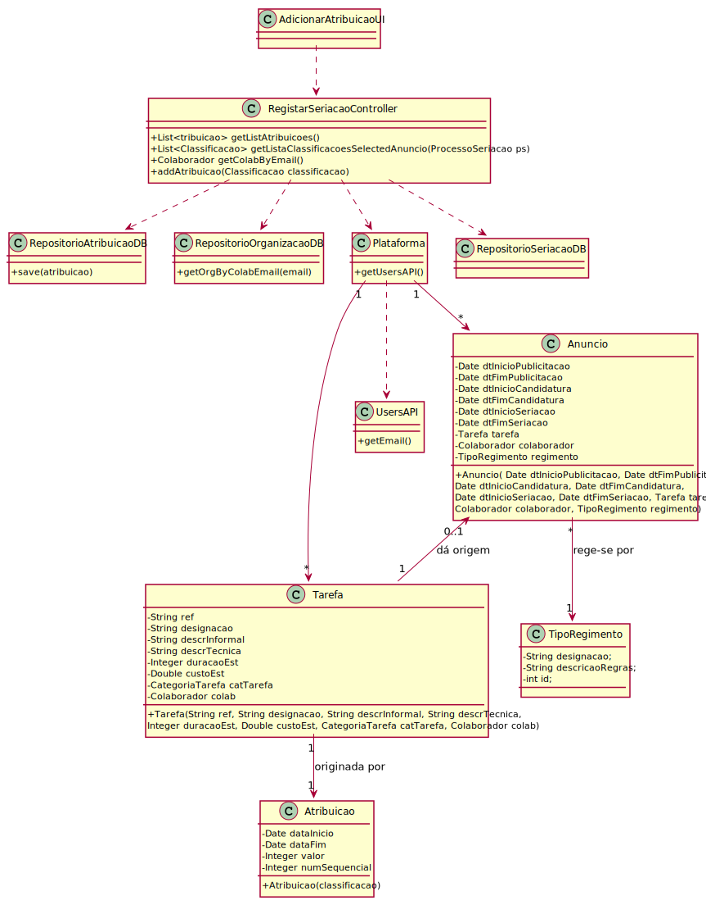

# UC13 - Adjudicar Tarefa

## 1. Engenharia de Requisitos

### Formato Breve
**Gestor como ator**

O gestor da organização inicia o processo de adjudicação de uma tarefa. O sistema pergunta qual o anúncio (dos já seriados) pretende o gestor escolher. O gestor escolhe. O sistema pede os dados (i.e. a organização que adjudica a tarefa, o freelancer a quem é adjudicada a realização da tarefa, a descrição da tarefa adjudicada, o período afeto, o valor remuneratório, uma referência ao anuncio). O gestor introduz. O sistema mostra os dados e pede a confirmação. O gestor confirma. O sistema regista a informação.

**Sistema como ator**

O sistema adjudica automaticamente a tarefa após a conclusão do processo de seriação. O sistema reúne os dados necessários (i.e. a organização que adjudica a tarefa, o freelancer a quem é adjudicada a realização da tarefa, a descrição da tarefa adjudicada, o período afeto, o valor remuneratório, uma referência ao anuncio), gera um número único sequencial anual e adjudica o anúncio automaticamente. O sistema quando termina regista os dados juntamente com a data/hora atual.

### SSD

### Formato Completo

#### Ator principal

Gestor e sistema (consoante o tipo de regimento do anúncio)

#### Partes interessadas e seus interesses
* **Gestor:** deseja adjudicar tarefas.
* **Organização:** pretende ver as suas tarefas ajudicadas a freelancers.
* **Freelancer:** pretende ter uma tarefa atribuída.
* **T4J:** pretende que as organizações utilizem a sua plataforma para contratar freelancers para executar tarefas.

#### Pré-condições
* Organização com pelo menos um gestor e/ou colaborador e freelancers registados no sistema.
* O sistema conta com tarefas já definidas.
* Existem tipos de regimento definidos no sistema.
* Existem anúncios já seriados.

#### Pós-condições
* Tarefa atribuída a um freelancer.

### Cenário de sucesso principal (ou fluxo básico)

1. O gestor da organização inicia o processo de adjudicação de uma tarefa.
2. O sistema pergunta qual o anúncio (dos já seriados) pretende o gestor escolher.
3. O gestor escolhe.
4. O sistema pede os dados (i.e. a organização que adjudica a tarefa, o freelancer a quem é adjudicada a realização da tarefa, a descrição da tarefa adjudicada, o período afeto, o valor remuneratório, uma referência ao anuncio).
5. O gestor introduz os dados solicitados.
6. O sistema mostra os dados e pede a confirmação.
7. O gestor confirma.
8. O sistema regista o sucesso da operação.

#### Extensões (ou fluxos alternativos)

**Sistema**
1. O sistema adjudica automaticamente a tarefa após a conclusão do processo de seriação.
2. O sistema reúne os dados necessários (i.e. a organização que adjudica a tarefa, o freelancer a quem é adjudicada a realização da tarefa, a descrição da tarefa adjudicada, o período afeto, o valor remuneratório, uma referência ao anuncio), gera um número único sequencial anual e adjudica o anúncio automaticamente.
3. O sistema quando termina regista os dados juntamente com a data/hora atual.

**Gestor**

*a. O gestor da organização solicita o cancelamento da adjudicação da tarefa.
> O caso de uso termina.

2a. Não existem tarefas para ser adjudicadas.
> O caso de uso termina.

4a. Dados mínimos obrigatórios em falta.
>	1. O sistema informa quais os dados em falta.
>	2. O sistema permite a introdução dos dados em falta (passo 4) 
>
	>	2a. O gestor não altera os dados. O caso de uso termina.

4b. O sistema deteta que os dados introduzidos (ou algum subconjunto dos dados) são inválidos.
>   1. O sistema alerta o gestor para o facto.
>   2. O sistema permite a sua alteração (passo 5).
>
	> 2a. O gestor não altera os dados. O caso de uso termina.

4c. O processo de atribuição é opcional

#### Requisitos especiais

#### Lista de Variações de Tecnologias e Dados
\-

#### Frequência de Ocorrência
* Sempre que necessário.

#### Questões em aberto
* Faz sentido haver seriação e atribuição caso só haja uma candidatura, ou, na data de fim de candidatura, a tarefa é adjudicada automaticamente?
* É possível que o freelancer possa rejeitar a atribuição da tarefa?

## 2. Análise OO

### Excerto do Modelo de Domínio Relevante para o UC

## 3. Design - Realização do Caso de Uso

###	Diagrama de Sequência

###	Diagrama de Classes

