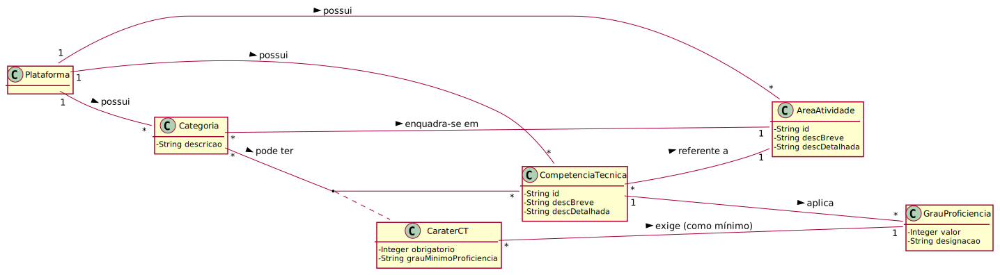

# UC3 - Registar Categoria da Tarefa

## 1. Engenharia de Requisitos

### Formato Breve

O administrativo inicia a definição de uma nova categoria de tarefa. O sistema solicita os dados necessários (i.e. descrição, área de atividade, lista de competências técnicas (quando existentes) e respetiva caracterização). O administrativo introduz os dados solicitados. O sistema valida e apresenta os dados ao administrativo, pedindo que os confirme. O administrativo confirma. O sistema regista os dados e informa o administrativo do sucesso da operação.

### SSD

### Formato Completo

#### Ator principal

Administrativo

#### Partes interessadas e seus interesses
* **Administrativo:** quer registar categorias das tarefas para mais tarde associar às tarefas.
* **T4J:** pretende que a plataforma esteja bem estruturada para facilitar a sua utilização pelas organizações.

#### Pré-condições
* Existência de pelo menos uma área de atividade. 

#### Pós-condições
* Uma nova categoria da tarefa é registada no sistema.

### Cenário de sucesso principal (ou fluxo básico)

1.  Inicia a definição de nova categoria de tarefa
2.  Mostra a lista de áreas de atividade e solicita a descrição da categoria de tarefa e a escolha de uma área de atividade
3.  Introduz a descrição e seleciona a área de atividade pretendida
4.  Mostra a lista de competências técnicas associadas à área de atividade especificada e solicita a escolha de uma ou mais, quando existentes
5.  Seleciona competência técnica solicitada
6.  Solicita indicação do seu caráter (i.e. obrigatória ou desejável)
7.  Introduz a informação pedida
8.  Apresenta os dados e solicita confirmação
9.  Confirma
10. Informa operação bem sucedida

#### Extensões (ou fluxos alternativos)

*a. O administrativo pede o cancelamento do registo da categoria de tarefa.  
> O caso de uso termina.
*b. A qualquer momento o sistema falha: Apresenta mensagem de erro.

#### Requisitos especiais
\-

#### Tecnologia e Lista de Variações Dados
\-

#### Frequência de Ocorrência
\- Sempre que se verificar a necessidade de criar uma nova categoria de tarefa. Tendencialmente não será necessário.

#### Questões em aberto

* Existem requisitos especiais para este caso de uso?

## 2. Análise OO

### Excerto do Modelo de Domínio Relevante para o UC

## 3. Design - Realização do Caso de Uso

###	Diagrama de Sequência

###	Diagrama de Classes

