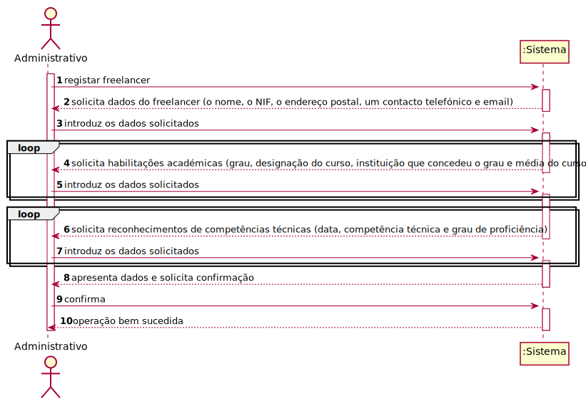
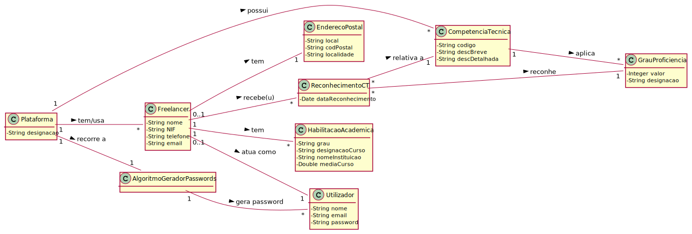
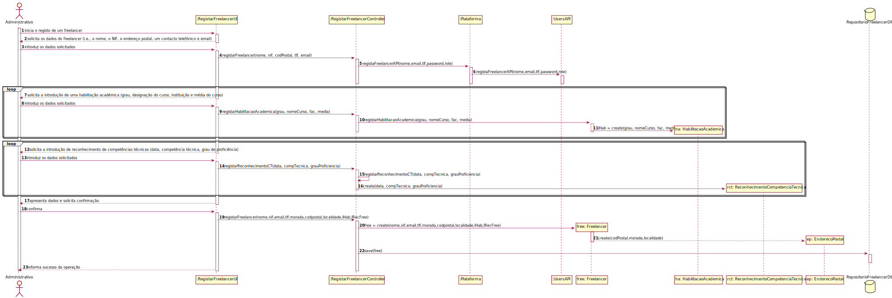
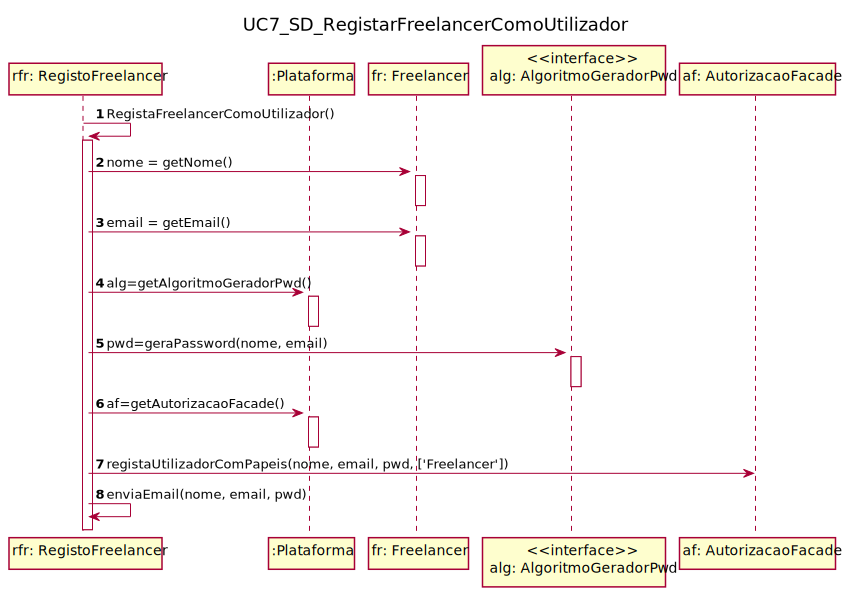
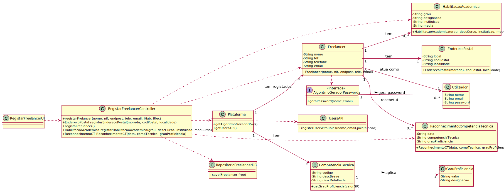

# UC7 - Registar Freelancer

## 1. Engenharia de Requisitos

### Formato Breve

O administrativo inicia o registo de um freelancer. O sistema solicita os dados que caracterizam o freelancer (i.e., o nome, o NIF, o endereço postal, um contacto telefónico e email), as suas habilitações académicas (grau, designação do curso, instituição que concedeu o grau e média do curso) e os reconhecimentos de competências técnicas (data, competência técnica, grau de proficiência) que lhe foram atribuídos. O administrador introduz os dados solicitados. O sistema valida e apresenta os dados, pedindo que os confirme. O administrador confirma. O sistema regista os dados do freelancer, cria um utilizador para o freelancer e envia-lhe por e-mail os dados de acesso à plataforma e, por fim, informa o administrativo do sucesso da operação. 

### SSD

### Formato Completo

#### Ator principal

Administrativo

#### Partes interessadas e seus interesses
* **Administrativo:** pretende registar freelancers para usarem a sua plataforma de forma a poderem realizar tarefas afetas a organizações.
* **Organização:** quer ter freelancers a candidatar-se para realizar as suas tarefas publicadas.
* **Freelancer:** pretende utilizar a plataforma de forma a candidatar-se a anúncios de organizações.
* **T4J:** pretende que a plataforma permita o registo de freelancers para posterior candidatura a anúncios.

#### Pré-condições
* Organização e Gestor de Organização estão registados no sistema.
* Colaborador da Organização já foi registado.
* O sistema conta com áreas de atividade, categorias de tarefa e competências técnicas já definidas.
* O algoritmo gerador de passwords está bem implementado.
* O sistema está preparado para enviar o email com os dados de acesso.

#### Pós-condições
* Freelancer registado no sistema.

### Cenário de sucesso principal (ou fluxo básico)

1. O administrativo inicia o registo de um freelancer.
2. O sistema solicita os dados que caracterizam o freelancer (i.e., o nome, o NIF, o endereço postal, um contacto telefónico e email).
3. O administrativo introduz os dados solicitados.
4. O sistema solicita a introdução de uma habilitação académica (grau, designação do curso, instituição que concedeu o grau e média do curso).
5. O administrativo introduz os dados solicitados.
6. Os passos 4-5 repetem-se até que o administrativo tenha introduzido todas as habilitações académicas do freelancer.
7. O sistema mostra a lista de competências técnicas e respetivos graus de proficiência e solicita a introdução de reconhecimento de competências técnicas (data, competência técnica, grau de proficiência) atribuídas.
8. O administrativo introduz os dados solicitados.
9. Os passos 7-8 repetem-se até que o administrativo tenha introduzido todos os reconhecimento de competências técnicas do freelancer.
10. O sistema valida e apresenta os dados, pedindo que os confirme.
11. O administrador confirma.
12. O sistema regista os dados do freelancer,cria um utilizador para o freelancer e envia-lhe por e-mail os dados de acesso à plataforma e, por fim, informa o administrativo do sucesso da operação.

#### Extensões (ou fluxos alternativos)

*a. O administrativo solicita o cancelamento da registo.

> O caso de uso termina.

10a. Dados de Endereço Postal incompletos.
>	1. O sistema informa quais os dados em falta.
>	2. O sistema permite a introdução dos dados em falta (passo 3)
>
	>	2a. O administrativo não altera os dados. O caso de uso termina.
	
10b. Dados mínimos obrigatórios em falta.
>	1. O sistema informa quais os dados em falta.
>	2. O sistema permite a introdução dos dados em falta (passo 3)
>
	>	2a. O administrativo não altera os dados. O caso de uso termina.

11c. O sistema deteta que os dados (ou algum subconjunto dos dados) introduzidos **(e.g. email) **devem ser únicos e que já existem no sistema.
>	1. O sistema alerta o administrativo para o facto.
>	2. O sistema permite a sua alteração (passo 3)
>
	>	2a. O administrativo não altera os dados. O caso de uso termina.

#### Requisitos especiais

* A password deve ser gerada pela plataforma recorrendo a um algoritmo externo.

#### Lista de Variações de Tecnologias e Dados
\-

#### Frequência de Ocorrência
\-

#### Questões em aberto

* Qual a frequência de ocorrência deste caso de uso?
* Que dados do freelancer devem ser únicos (nome, email, contacto)?
* Que dados do freelancer devem, em conjunto, ser suficientes para prevenir que seja registado um freelancer repetido?
* A influência dos RH (elemento externo) na certificação do CV do freelancer deve ser relevante no modelo e sua implementação?
* As habilitações académicas (média, curso, etc) devem efetivamente ser relevantes? Se sim, qual a influência do curso na seriação de freelancers?

## 2. Análise OO

### Excerto do Modelo de Domínio Relevante para o UC

## 3. Design - Realização do Caso de Uso

###	Diagrama de Sequência

#### Diagrama de Sequência Secundário ####

###	Diagrama de Classes

