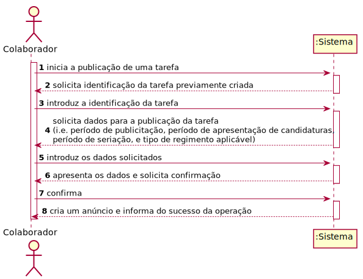
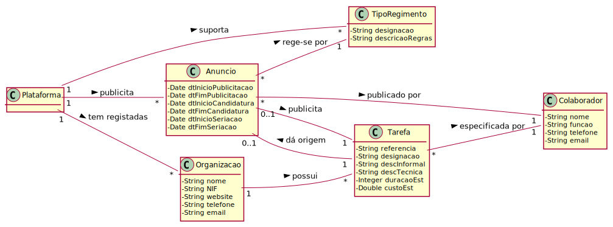
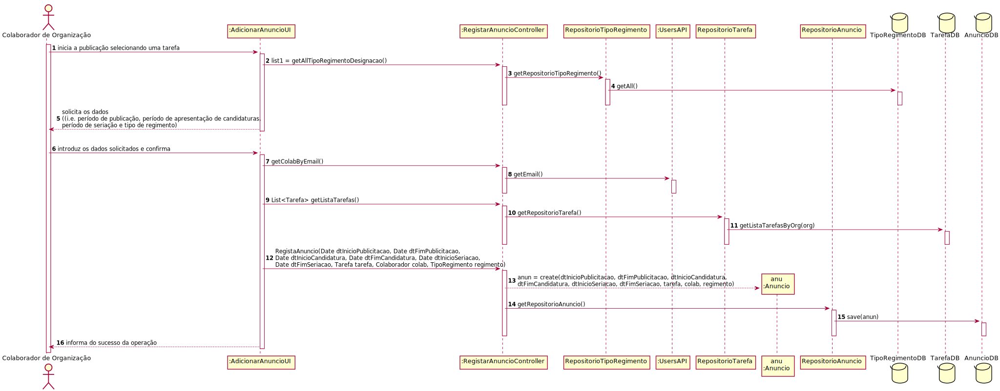
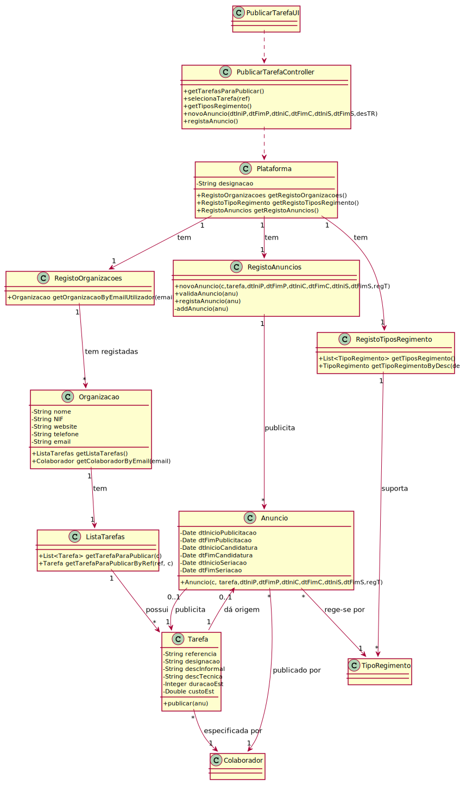

# UC8 - Publicar Tarefa

## 1. Engenharia de Requisitos

### Formato Breve

O colaborador da organização inicia a publicação de uma tarefa. O Colaborador seleciona uma tarefa existente na organização, previamente criada. O sistema solicita os dados necessários para a publicação da tarefa (i.e. período de publicitação, período de apresentação de candidaturas, período de seriação e tipo de regimento aplicável). O colaborador da organização introduz os dados solicitados. O sistema valida e apresenta os dados ao colaborador da organização e pede a sua confirmação. O colaborador da organização confirma. O sistema regista os dados e cria um anúncio e informa o colaborador do sucesso da operação. 

### SSD

### Formato Completo

#### Ator principal

Colaborador

#### Partes interessadas e seus interesses
* **Colaborador:** deseja publicar tarefas.
* **Organização:** pretende que os seus colaboradores publiquem tarefas, dando origem a um anúncio alvo de candidaturas.
* **Freelancer:** pretende ver anúncios (originados pela publicação de tarefas) a que se pode candidatar.
* **T4J:** pretende a adjudicação de tarefas a freelancers através do processo de candidaturas e seriação das mesmas.

#### Pré-condições
* Organização com pelo menos um gestor e/ou colaborador registados no sistema.
* O sistema conta com tarefas já definidas.
* Existem tipos de regimento definidos no sistema.

#### Pós-condições
* Anúncio publicado no sistema originado pela publicação de uma tarefa.

### Cenário de sucesso principal (ou fluxo básico)

1. O colaborador da organização inicia a publicação de uma tarefa.
2. O sistema apresenta as tarefas criadas pelo colaborador da organização e que ainda não foram alvo de publicação e pede que seja selecionada uma.
3. O colaborador da organização seleciona uma tarefa.
4. O sistema solicita os dados necessários para a publicação da tarefa (i.e. período de publicitação, período de apresentação de candidaturas, período de seriação).
5. O colaborador da organização introduz os dados solicitados.
6. O sistema mostra os tipos de regimentos passiveis de serem aplicados e solicita a selecção de um.
7. O colaborador seleciona o tipo de regimento pretendido.
8. O sistema valida e apresenta os dados ao colaborador da organização e pede a sua confirmação.
9. O colaborador da organização confirma.
10. O sistema regista os dados e cria o anúncio e informa o colaborador da organização do sucesso da operação.

#### Extensões (ou fluxos alternativos)

*a. O colaborador da organização solicita o cancelamento da publicação da tarefa.
> O caso de uso termina.

2a. Não existem tarefas criadas pelo colaborador da ordanização que ainda não tenham sido publicadas.
> O caso de uso termina.

8a. Dados mínimos obrigatórios em falta.
>	1. O sistema informa quais os dados em falta.
>	2. O sistema permite a introdução dos dados em falta (passo 4)
    >
	>	2a. O colaborador de organização não altera os dados. O caso de uso termina.

8b. O sistema deteta que os dados introduzidos (ou algum subconjunto dos dados) são inválidos.
>   1. O sistema alerta o colaborador de organização para o facto.
>   2. O sistema permite a sua alteração (passo 5).
>
	> 2a. O colaborador da organização não altera os dados. O caso de uso termina.

#### Requisitos especiais

#### Lista de Variações de Tecnologias e Dados
\-

#### Frequência de Ocorrência
* Sempre que necessário.

#### Questões em aberto
* O código único do anúncio deve corresponder ao código único/referência da tarefa?
* Se um anúncio não tiver qualquer candidatura findo o período de apresentação das mesmas, deve ser automaticamente renovado?
* Os anúncios devem estar segmentados por alguma categoria, como as tarefas?

## 2. Análise OO

### Excerto do Modelo de Domínio Relevante para o UC

## 3. Design - Realização do Caso de Uso

###	Diagrama de Sequência

###	Diagrama de Classes

