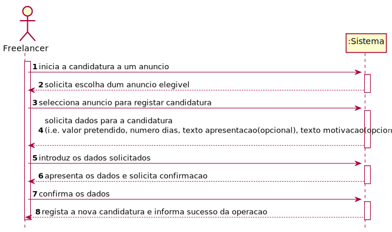
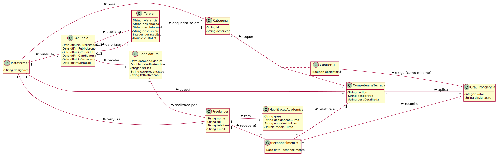
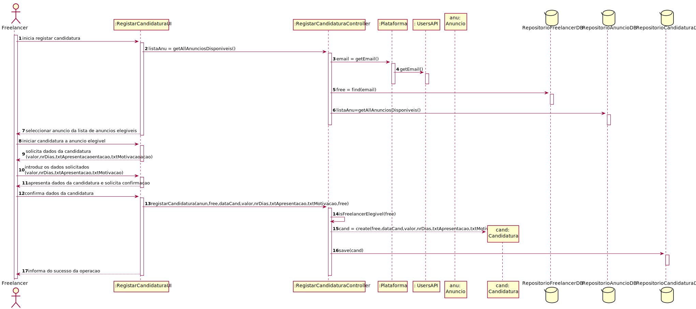
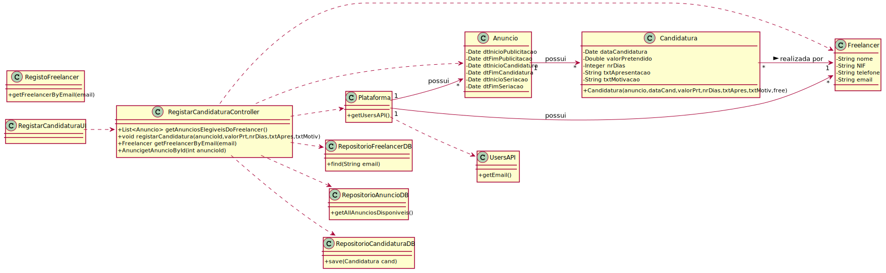

# UC9 - Efetuar Candidatura

## 1. Engenharia de Requisitos

### Formato Breve

O Freelancer inicia a candidatura a um anúncio. O sistema solicita a escolha do anúncio duma lista de anúncios em período de candidatura e para os quais o Freelancer está elegível. O Freelancer identifica o anúncio para o qual pretende apresentar uma candidatura. O sistema solicita os dados necessários para a candidatura ao anúncio (i.e. valor pretendido, numero dias, texto apresentação (opcional), texto motivação (opcional)). O Freelancer introduz os dados solicitados. O sistema valida e apresenta os dados ao Freelancer e pede a sua confirmação. O Freelancer confirma os dados. O sistema regista uma nova candidatura ao anúncio e informa o Freelancer do sucesso da operação.  

### SSD

### Formato Completo

#### Ator principal

Freelancer

#### Partes interessadas e seus interesses
* **Colaborador:** deseja que as tarefas que publicou (e que originaram anúncios) recebam candidaturas.
* **Organização:** pretende receber candidaturas para os anúncios que lhe são afetos, tendo sido publicados pelos seus colaboradores.
* **Freelancer:** pretende verificar a lista de anúncios e candidatar-se a um deles.
* **T4J:** deseja rececionar candidaturas para posterior seriação e atribuição de tarefas afetas a organizações.

#### Pré-condições
* Organização e Gestor de Organização estão registados no sistema.
* Colaborador da Organização já foi registado.
* O sistema conta com áreas de atividade, categorias de tarefa e competências técnicas já definidas.
* Pelo menos um freelancer já foi registado.
* Tarefas já foram publicadas, tendo originado anúncios.
* Período de candidaturas de, pelo menos, um anúncio já começou e ainda não terminou.

#### Pós-condições
* Uma candidatura a um anúncio é registada no sistema.

### Cenário de sucesso principal (ou fluxo básico)

1. O Freelancer inicia a candidatura a um anúncio.
2. O sistema solicita a escolha do anúncio duma lista de anúncios em período de candidatura e para os quais o Freelancer está elegível.
3. O Freelancer identifica o anúncio para o qual pretende apresentar uma candidatura.
4. O sistema solicita os dados necessários para a candidatura ao anúncio (i.e. valor pretendido, numero dias, texto apresentacão(opcional), texto motivação(opcional)).
5. O Freelancer introduz os dados solicitados.
6. O sistema valida e apresenta os dados ao Freelancer e pede a sua confirmação.
7. O Freelancer confirma os dados.
8. O sistema regista uma nova candidatura ao anúncio e informa o Freelancer do sucesso da operação.

#### Extensões (ou fluxos alternativos)

*a. O Freelancer solicita o cancelamento da candidatura a anúncio.
> O caso de uso termina.

2a. Não existem anúncios em período de candidatura.
> O caso de uso termina.

2b. Não existem anúncios elegíveis para o Freelancer.
> O caso de uso termina.

6a. Dados mínimos obrigatórios em falta.
>	1. O sistema informa quais os dados em falta.
>	2. O sistema permite a introdução dos dados em falta (passo 4)
>
	> 2a. O freelancer não altera os dados. O caso de uso termina.

6b. O sistema deteta que os dados introduzidos (ou algum subconjunto dos dados) são inválidos.
>   1. O sistema alerta o Freelancer para o facto.
>   2. O sistema permite a sua alteração (passo 5).
>
	> 2a. O Freelancer não altera os dados. O caso de uso termina.

#### Requisitos especiais

#### Lista de Variações de Tecnologias e Dados
\-

#### Frequência de Ocorrência
\-

#### Questões em aberto

* O freelancer pode candidatar-se mais do que uma vez ao mesmo anúncio?
* O freelancer pode candidatar-se a mais do que um anúncio?
* O freelancer pode candidatar-se a um anúncio estando já alocado e a trabalhar para uma organização?
* Que tipo de informação de um anúncio, tarefa ou organização pode o freelancer ver?
* O freelancer pode verificar quantas candidaturas já foram feitas ao anúncio a que se está a candidatar? Se sim, pode vê-las?
* O freelancer pode alterar, ou remover, qualquer candidatura já por si efetuada?

## 2. Análise OO

### Excerto do Modelo de Domínio Relevante para o UC

## 3. Design - Realização do Caso de Uso

### Diagrama de sequência

###	Diagrama de Classes

